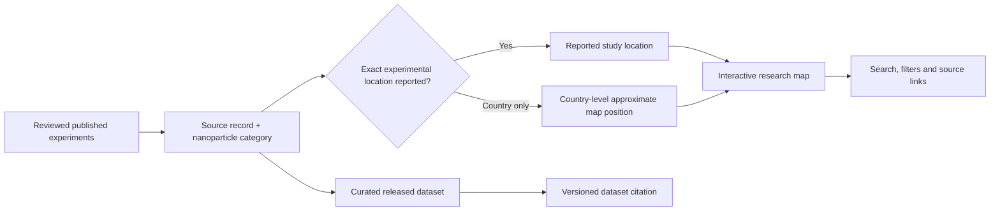

# Nanoparticle-assisted solar still study map | Visual research case study

**Public project:** [Interactive map](https://aryakia.github.io/solar-still-nanoparticle-map/index.html) · [Released dataset DOI](https://doi.org/10.5281/zenodo.20109066) · [Citation metadata](../CITATION.cff). The existing [README](../README.md) documents the study-location method and explicitly distinguishes precise experimental locations from country-only records.

## Research evidence pipeline

**Interpretation:** An approximate country coordinate is a display convention, not a measured experimental-site location. A map of reviewed studies reveals the *distribution of documented research*, not an unbiased measure of global solar-still performance or adoption. Do not treat findings from distinct experimental designs as directly comparable without checking the publications.

## Public evidence and figures

The repository already includes an actual [interactive application](../index.html), the released [Excel dataset](../solar-still-nano-enhanced-data.xlsx), and a project-authored [static SVG map](../solar-still-nano-enhanced-map.svg). This existing SVG is a **research map**, not a UI screenshot. Use the linked released dataset and DOI when presenting figures, and verify the current data version before updating quantitative claims.

## Screenshot status

A new actual browser screenshot has **not** been added: a reliable live browser capture was unavailable in this review environment. An approved screenshot should show the public map with a clearly visible legend and one public source-linked study; avoid implying that approximate map points are precise experiments.

## Suggested GitHub About fields (not applied)

- **Description:** `Interactive evidence map and citable dataset of nanoparticle-assisted solar still desalination studies.`
- **Topics:** `solar-desalination`, `nanoparticles`, `research-data`, `geospatial`, `data-visualization`
- **Homepage:** `https://aryakia.github.io/solar-still-nanoparticle-map/index.html` (verify live accessibility before applying).

No new source licence is assigned or implied.